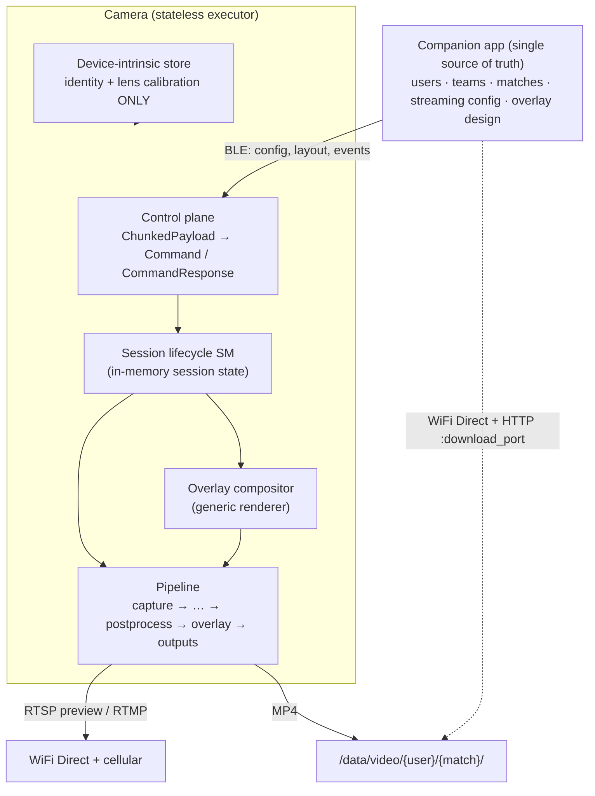

# App-as-Source-of-Truth Firmware Refactor

## Summary

Refactor the ScoutCamera firmware so the companion app is the sole source of truth and the camera is a **stateless executor** of the app's proto3 BLE contract. The camera receives session config, a declarative overlay layout, and match/score/banner events over a `ChunkedPayload` → `Command`/`CommandResponse` protocol; renders the overlay identically onto one continuous MP4 and the live RTSP/RTMP feed; serves post-session downloads over WiFi Direct + HTTP; and persists nothing across sessions except its own device identity and lens calibration.

## Problem Frame

The firmware was built as a semi-autonomous device that *owned* business state: a full SQLite schema (`user`, `team`, `match`, `sport`, `recording`, `stream-config`), a `DbSeeder`, a `match-service`, and `team`/`sport`/`match` controllers. That made the camera a second source of truth competing with the app.

The app team has now published a contract (`docs/firmware-spec.md` in the `sst-cam-app` repo, plus the `sst-cam-proto` schema repo now pinned here at `proto/`) that inverts this: the app owns all users, teams, matches, streaming configs, and overlay design; the camera just executes. Much of what the firmware persists exists only to support the old model and now actively contradicts the contract's "never persist business data across sessions" rule. The control envelope is also half-built — `Command{route, payload, correlation_id}` exists, but the payload is "opaque bytes until the .proto arrives," `correlation_id` is the wrong type, and the contract-mandated surfaces (overlay compositor, WiFi Direct, HTTP download server, session lifecycle) don't exist yet.

## Key Decisions

- **Strip to stateless.** Delete the business persistence layer — the SQLite business entities, `DbSeeder`, `match-service`, and the `team`/`sport`/`match` controllers. The camera keeps only device-intrinsic persistent state (device identity, lens calibration); everything session-scoped lives in memory and is cleared on disconnect.
- **Proto schema as a git submodule, from a dedicated `sst-cam-proto` repo.** The contract (`bluetooth.proto` + `wifi.proto`) lives in a standalone schema repo that both the app and firmware pin as a submodule and codegen from — so neither side drifts, and the firmware avoids dragging in the app's Flutter SDK deps that a whole-app-repo submodule would carry. The repo (`github.com/ScoutSportTechnology/sst-cam-proto`) is now mounted in this tree at `proto/`. (Sharing the *schema* at build time is distinct from the runtime overlay push — the submodule ships the message *shape*; the app sends filled-in *instances* per session.)
- **Big-bang rewrite, not incremental strangle.** Rebuild on the feature branch toward a clean target tree rather than running old and new control planes side by side. Accepted cost: a longer broken-tree period (mitigated by keeping per-module compilation green even before full integration is wired).
- **Overlay via pre-rendered RGBA layer.** Render the declarative overlay scene to an RGBA surface only when a data binding changes (clock ~1 Hz, scores/banners on events), then hardware-composite that layer onto video — rather than redrawing every frame or pulling in Skia.
- **Passthrough director for the pipeline.** Build the real `capture → preprocess → buffer → postprocess → overlay → outputs` orchestration now, but with a trivial decision stage (always cam0, no crop) so the AI auto-director drops into that seam later without rewiring.

## Source-of-Truth Fan-Out

## Requirements

### Protocol & control plane

- R1. All BLE traffic is proto3, wrapped in a `ChunkedPayload{correlation_id (UUID v4 string), chunk_index, total_chunks, data}` envelope whose `data` carries an encoded `Command` (app→camera) or `CommandResponse` (camera→app).
- R2. Two GATT characteristics carry the protocol, under the SST-Cam service (`A1B2C3D4-0001-...`): a Command Write characteristic (`...0011`, Write Without Response) the app writes to, and a Command Response characteristic (`...0012`, Notify) the camera notifies on. (UUIDs are placeholders in the contract until officially registered.)
- R2a. The camera is discoverable per the contract's two-layer filter: it **advertises the SST-Cam service UUID** in its BLE advertising payload, and sets its BLE device name to `sst-cam-NNNN` (zero-padded 4-digit unit number, e.g. `sst-cam-0042`). The app filters scan results by both.
- R3. `ChunkedPayload` wraps traffic in **both** directions. App→camera writes are also chunked (e.g. a large `PushOverlayLayout` arrives across multiple chunks); the camera reassembles all chunks before decoding the inner `Command`. Camera→app multi-chunk responses use the `ChunkAck` flow-control handshake — send one chunk, wait for a `ChunkAck` write, send the next. Single-chunk messages use `chunk_index=0, total_chunks=1` with no reassembly.
- R4. Every `Command` receives exactly one `CommandResponse` with a matching `correlation_id`. Commands with no data payload still get `CommandResponse(status=OK)` with no `oneof` set.
- R5. The existing control envelope is migrated to match: `correlation_id` changes from `uint64_t` to a UUID-v4 string, `route`+opaque-payload becomes proto `oneof` dispatch, and the internal status maps onto `ResponseStatus{OK, ERROR, TIMEOUT, UNSUPPORTED}`.
- R6. Deferred / unimplemented commands respond `status=UNSUPPORTED`; a command the camera recognizes but cannot process responds `status=ERROR` with a descriptive `error_message`. Either way every command gets a response — none is ever left hanging.
- R7. The camera never pushes unsolicited data; it only responds to commands. Telemetry is delivered by the app polling `GetTelemetry` (~1 Hz), not by camera-initiated notifications.
- R8. `GetDeviceInfo` returns `device_id` and `protocol_version`, establishing a version handshake between app and firmware.
- R8a. Version mismatch is never grounds for rejecting the connection. The camera accepts any command it recognizes and returns `UNSUPPORTED` (per R6) for any it does not; version handling on the app side (warn / disable features) is the app's concern.

### Statelessness & persistence

- R9. No business data (users, teams, matches, sports, streaming configs) is persisted anywhere on the camera. The SQLite business schema, `DbSeeder`, `match-service`, and `team`/`sport`/`match` controllers are removed.
- R10. The only camera-owned persistent state is device-intrinsic: device identity and lens calibration. This survives across sessions and reboots; nothing else does.
- R11. Session state (config, overlay layout, scores, clock, period) is held in memory only and is cleared whenever the session ends — explicit stop or disconnect.

### Session lifecycle

- R12. A within-session state machine drives the ordered flow: BLE connect → `GetDeviceInfo` → `StartWifiDirect` → `PushSessionConfig` → `PushOverlayLayout` → recording/streaming/events → finalization.
- R13. `PushSessionConfig` is stored in memory and triggers preparation of the output directories under `/data/video/{user_uuid}/{match_uuid}/` and `/data/thumbnail/{user_uuid}/{match_uuid}/`.
- R14. On `RecordingControl(RECORDING_STOP)` the camera finalizes and closes the MP4 immediately.
- R15. On **unexpected BLE disconnect**, the camera finalizes whatever was recorded even without a `RECORDING_STOP`, and — regardless of which happens first — closes the RTMP stream if active, tears down the WiFi Direct group, and clears session config from memory.

### Overlay compositor

- R16. The camera is a generic compositor with no hard-coded layouts. It renders whatever `PushOverlayLayout` describes: `OverlayLayout{canvas_width, canvas_height, elements[], templates[]}`.
- R17. Each `OverlayElement` is rendered per its `shape` (`SHAPE_RECT`/`SHAPE_TEXT`/`SHAPE_CIRCLE`), `bounds` (`OverlayRect{x1,y1,z,x2,y2}` — float logical-canvas coords with z-order), `style` (fill/text color, opacity, corner_radius, font_family/size/weight, text_align, static_text), `binding`, and `visible` flag.
- R18. Data bindings auto-update from match events: `BINDING_SCORE_A/B/VS` from `ScoreUpdate`, `BINDING_MATCH_CLOCK` (MM:SS) and `BINDING_PERIOD_LABEL` from `MatchControl`, `BINDING_TEAM_A/B_NAME` from session config, `BINDING_STATIC` never.
- R19. `BannerEventCommand(template_id, params, duration_s)` finds the `OverlayTemplate` whose `event_type` matches, substitutes `{{param_name}}` in `static_text`, shows the template's elements, then removes them. The command's `duration_s` overrides the template's `duration_ms` at activation time (so the app can vary duration per event without resending the layout); the template's `duration_ms` is the fallback when the command omits a duration.
- R20. The overlay is rendered **identically** on the live feed and the recorded MP4 — both derive from the same layout spec and the same live data. The match clock is ticked locally for smooth MM:SS display but the app is the timing authority (`MATCH_KICKOFF`/`PERIOD_END`/`PERIOD_START`/`FINAL_WHISTLE`/`CLOCK_PAUSE`/`CLOCK_RESUME`); the clock is display-only.

### Recording, streaming & downloads

- R21. Recording produces **one continuous MP4** per session at `/data/video/{user_uuid}/{match_uuid}/{match_uuid}.mp4`. `RECORDING_PAUSE`/`RECORDING_RESUME` pause and resume the muxer into the *same* file — not segments. The segment-based storage adapters are reworked or dropped accordingly.
- R22. `StreamingControl(STREAMING_START, destination)` pushes to the app-supplied RTMP destination; `STREAMING_STOP` closes it. RTMP egress travels over cellular while the WiFi Direct group serves the local preview and downloads.
- R23. `StartWifiDirect` forms a WiFi Direct P2P group (group-owner mode) and returns `WifiDirectGroupResponse{ssid, psk, group_owner_ip, preview_port, download_port, role}` before preview/recording/download features are enabled.
- R24. Post-session file access is served by an HTTP server on the WiFi Direct `download_port`. `DownloadRequest` returns a `DownloadTokenResponse{recording_id, http_url, auth_token, expires_at}` with a short-lived per-request bearer token; `ListRecordings` enumerates available files.

### Pipeline & build

- R25. The video path is wired as a real per-camera pipeline (`capture → preprocess → buffer → postprocess`) feeding the overlay compositor and the MP4 + RTSP/RTMP outputs, with a passthrough decision stage (always cam0, no crop). AI / physics / real camera-selection are not implemented but the seam exists for them.
- R26. The firmware build codegens C++ from the `sst-cam-proto` submodule mounted at `proto/` (`bluetooth.proto` + `wifi.proto` — the contract's six original BLE schema files are consolidated into the single `bluetooth.proto`); `protobuf`/`protoc` is added to the JetPack sysroot (`.devcontainer/sysroot/003_install_extra_pkgs.sh`) and linked `REQUIRED` in `CMakeLists.txt` per the dependency-adding rule. The dev-container setup initializes submodules so the schema is always present at build.
- R27. Every new domain model ships a `fmt::formatter` specialization per the project's models rule; module-boundary tests (including hardware-bound ones) are written and committed even where they can't pass in the cross-compile container.

## Key Flows

- F1. Connect → ready-to-record
  - **Trigger:** App establishes a BLE connection.
  - **Steps:** GATT ready → `GetDeviceInfo` (device_id, protocol_version) → app begins ~1 Hz `GetTelemetry` polling → `StartWifiDirect` returns group credentials + endpoints → `PushSessionConfig` (stored in memory, output dirs prepared) → `PushOverlayLayout` (renderer configured).
  - **Outcome:** Camera is configured and ready; nothing persisted beyond device-intrinsic state.
  - **Covers:** R1, R4, R7, R8, R12, R13, R16, R23.

- F2. Live match
  - **Trigger:** `RecordingControl(RECORDING_START)`.
  - **Steps:** open MP4 → `StreamingControl(STREAMING_START, rtmp)` → `MatchControl(MATCH_KICKOFF, period=1)` ticks clock + shows transient overlay → `ScoreUpdate` and `BannerEvent` update bindings/templates on both feed and recording → period transitions via `MatchControl` → `RECORDING_STOP` finalizes the single MP4 → `STREAMING_STOP`.
  - **Outcome:** One continuous MP4 with baked-in overlay; live feed showed the identical overlay.
  - **Covers:** R14, R18, R19, R20, R21, R22.

- F3. Unexpected disconnect
  - **Trigger:** BLE drops mid-recording with no `RECORDING_STOP`.
  - **Steps:** finalize in-progress MP4 → close RTMP if active → tear down WiFi Direct group → clear session config from memory.
  - **Outcome:** A playable recording survives; the camera returns to a clean stateless idle.
  - **Covers:** R11, R15.

- F4. Post-session download
  - **Trigger:** `ListRecordings` / `DownloadRequest` after the session.
  - **Steps:** camera returns available recordings → issues a short-lived bearer token + URL → app fetches the MP4 over WiFi Direct HTTP on `download_port`.
  - **Outcome:** File transferred over the local high-bandwidth link; token expires.
  - **Covers:** R24.

## Acceptance Examples

- AE1. **Covers R6.** Given a `Command` whose `oneof` selects a not-yet-implemented capability, when it arrives, then the camera replies `CommandResponse(status=UNSUPPORTED)` with the same `correlation_id` — never silence.
- AE2. **Covers R15.** Given an in-progress recording, when BLE disconnects without `RECORDING_STOP`, then the MP4 is finalized to a playable file, RTMP is closed, the WiFi Direct group is torn down, and session memory is cleared.
- AE3. **Covers R19.** Given an `OverlayTemplate` with `event_type="goal"`, when `BannerEventCommand(template_id="goal", params={...}, duration_s=5)` arrives, then the camera substitutes `{{param}}` values into the template's `static_text`, shows its elements for 5 s on both feed and recording, and removes them when the duration expires.
- AE4. **Covers R20, R21.** Given a session recording with `RECORDING_PAUSE` then `RECORDING_RESUME`, when playback is reviewed, then the output is a single continuous MP4 (not segments) with the same overlay that appeared live.

## Scope Boundaries

### Deferred for later
- AI auto-director: TensorRT tracking, physics, and the real decision stage (which camera + crop). The passthrough cam0/no-crop stub stands in.
- Second-camera feed and any dual-camera stitching/selection.
- Microphone (MAX4466) / audio capture — current assumption is a video-only MP4 (see Outstanding Questions).

### Outside this product's identity
- Any business-data persistence on the camera (users, teams, matches, streaming configs). The camera is permanently a stateless executor; re-adding a local business store is a non-goal, not a deferral.
- Camera-side overlay design or default layouts baked into firmware. The camera renders only what the app pushes; defaults belong in the app.

## Dependencies / Assumptions

- **Canonical proto repo (done).** The standalone `sst-cam-proto` repo holds `bluetooth.proto` + `wifi.proto` and is pinned here as a submodule at `proto/`; the app pins the same repo. No longer a blocking dependency.
- **Build deps.** `protobuf`/`protoc` must be added to the sysroot and linked; the dev-container clone/setup must initialize submodules so the build always has the schema. (The schema files are present; the codegen wiring is not yet built.)
- **WiFi Direct + cellular coexistence.** RTMP egress is assumed to route over cellular while the WiFi Direct P2P group serves local preview/download — interface binding/routing needs to hold both up simultaneously.
- **Storage rework.** The single-continuous-MP4 + muxer pause/resume model replaces the existing segment/merge approach; the segment adapters are not reused as-is.
- **Identical-rendering fidelity.** Pixel-equivalence between the camera (GStreamer/Cairo) and the app (Flutter) depends on bundling identical fonts and agreeing on coordinate/anchor/alignment semantics on both sides.

## Outstanding Questions

### Resolved
- **Audio** — out of scope for now; the MP4 is video-only and the microphone module stays deferred.
- **Bidirectional chunking** — app→camera writes also use `ChunkedPayload`; firmware reassembles before decoding (R3).
- **Banner duration precedence** — command `duration_s` overrides template `duration_ms` at activation, template value is the fallback (R19).
- **Canonical proto repo** — dedicated `sst-cam-proto` repo (`bluetooth.proto` + `wifi.proto`), both sides pin it; now mounted in this tree at `proto/` (R26, Key Decisions).
- **Version mismatch policy** — camera never rejects on version; accepts known commands, `UNSUPPORTED` for unknown (R8a).

### Deferred to planning
- Thumbnail generation timing and trigger (`thumbnail_output_path`, `ThumbnailResponse`).

## Sources / Research

- Contract: `docs/firmware-spec.md` in the `sst-cam-app` repo, plus `bluetooth.proto` + `wifi.proto` + `README.md` in the `sst-cam-proto` repo (pinned here as a submodule at `proto/`) — overlay model, session lifecycle, command catalog, `ResponseStatus`, GATT layout, BLE discovery/advertising rules.
- Current control plane: `src/app/control/services/` (controllers, `control-module`), `src/domain/control/models/command.hpp` / `command-result.hpp`.
- Persistence to remove: `src/{domain,app,adapters}/db/`, `src/app/match/`, `src/app/control/services/controllers/{team,sport,match}.controller.*`.
- Storage to rework: `src/adapters/storage/gstreamer/gst-segment-{recorder,merger}.*`, `gst-event-clip-recorder.*`; disk guard `src/adapters/storage/filesystem/filesystem-disk-guard.*` is reusable.
- Networking to extend: `src/adapters/control/wifi/wpa_supplicant/` (infra → P2P), `src/adapters/streaming/gst_rtsp/`, `gst_rtmp/`.
- Project rules: `CLAUDE.md` (hexagonal layering, no-skeletons, models need formatters, sysroot dependency procedure, module-boundary tests).
