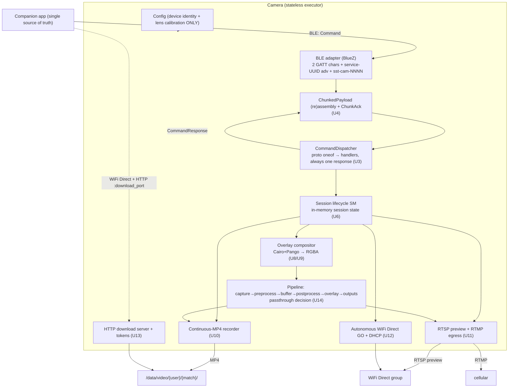
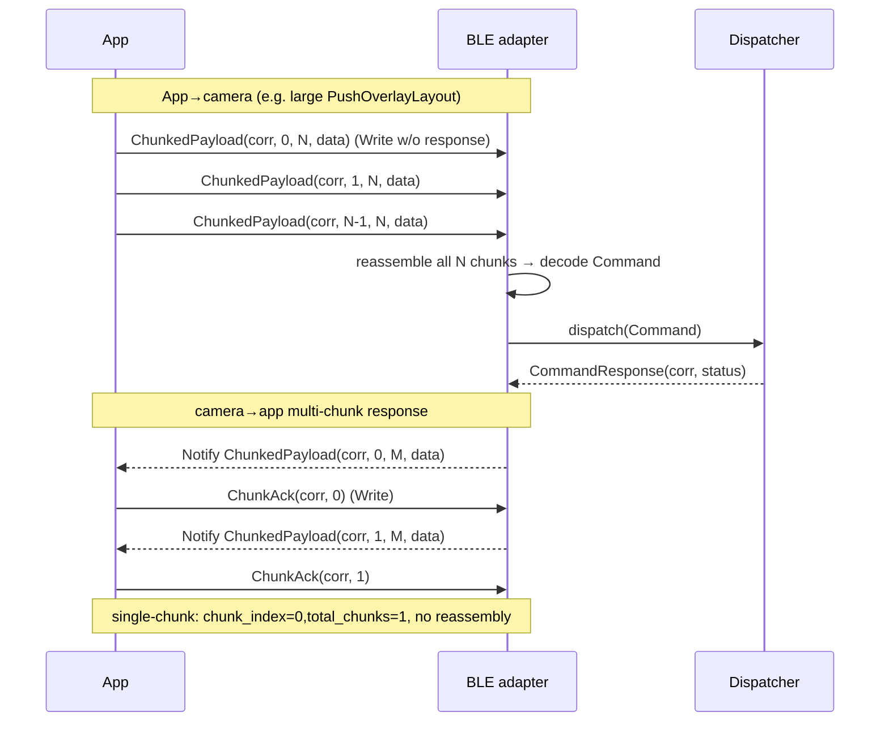
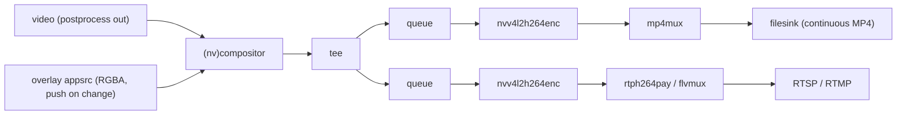

# refactor: App-as-Source-of-Truth Firmware — Stateless Executor

## Summary

Rebuild the ScoutCamera firmware so the companion app is the sole source of truth and the camera is a **stateless executor** of the `sst-cam-proto` contract (`proto/bluetooth.proto` + `proto/wifi.proto`). The camera: receives session config, a declarative overlay layout, and match/score/banner events over a `ChunkedPayload → Command/CommandResponse` proto3 protocol on two GATT characteristics; renders the overlay **identically** onto one continuous MP4 and the live RTSP/RTMP feed; serves post-session downloads over an autonomous WiFi Direct group + HTTP; and persists nothing across sessions except device identity and lens calibration.

This is a **big-bang rewrite on the feature branch** (per the origin's Key Decisions): strip the business-persistence layer, migrate the control envelope from `{route, opaque bytes, uint64 correlation_id}` to proto `oneof` dispatch with UUID-v4 `correlation_id`, codegen C++ from the pinned `proto/` submodule, and build the missing contract surfaces (session lifecycle SM, overlay compositor, autonomous WiFi Direct, HTTP downloads, single-continuous-MP4 recording, passthrough pipeline). The accepted cost is a longer broken-tree period, mitigated by keeping the static library (`sst_cam_firmware_internal_libs`) compiling green at every unit boundary.

**Resolved forks** (from planning dialogue, superseding the soft-AP stand-in the existing adapter ships):
- **WiFi Direct is realized as a *real autonomous P2P group-owner*** (`p2p_group_add`, non-persistent). The GO generates its own SSID/passphrase; the camera reads them back and reports them in `WifiDirectGroupResponse` over BLE, so the app consumes whatever the camera generated (the app side will be updated to match). Triggered by `StartWifiDirectCommand`.
- **Overlay rasterizer = Cairo + Pango** → RGBA surface (best shot at pixel-parity with the app's Flutter overlay).
- **Per-recording disk thumbnail is written at recording finalization** (`RECORDING_STOP` / disconnect-finalize); the on-demand BLE `ThumbnailRequest` path is separate and grabs the live frame.

---

## Problem Frame

The firmware was built as a semi-autonomous device that *owned* business state — a full SQLite schema (`user`, `team`, `match`, `sport`, `recording`, `stream-config`), a `DbSeeder`, a `match-service`, and `team`/`sport`/`match` controllers — making the camera a second source of truth competing with the app. The app team has published a contract (`docs/firmware-spec.md` in `sst-cam-app`, plus the `sst-cam-proto` schema pinned here at `proto/`) that inverts this: the app owns all users, teams, matches, streaming configs, and overlay design; the camera just executes.

The current control envelope is half-built: `Command{route, payload(opaque bytes), correlation_id(uint64)}` exists (`src/domain/control/models/command.hpp`), dispatched by string `route` through `BleModule` to per-concern `IController`s, with a hand-rolled wire format in `BluezBleTransport`. The contract-mandated surfaces (proto dispatch, chunked framing + `ChunkAck`, overlay compositor, autonomous WiFi Direct, HTTP download server, session lifecycle SM) don't exist yet. Much of what the firmware persists exists only to support the old model and now actively contradicts the contract's "never persist business data across sessions" rule.

**What already exists and is reused** (from repo research): the hexagonal layer-first module layout; `BluezBleTransport` + `GattApplication` (two GATT chars + service-UUID advertising topology already correct — only UUIDs/flags/name change); `WpaWifiManager` ctrl_iface plumbing behind `IWifiManager`; the GStreamer adapter patterns (`gst_parse_launch` + named appsrc/appsink, NVENC `nvv4l2h264enc`, `gst-rtsp-server`); `PipelineOrchestrator` (already the passthrough/no-AI seam, R25); `FilesystemDiskGuard`; the config module (`ConfigLoader` over `device.json`/`calibration.json`/`storage.json`/`wifi-direct.json`) — the only persistent state to keep; the `fmt::formatter` + `_fmt.hpp` model convention; the GTest module-boundary test pattern with `NextSuffix()` isolation.

---

## Requirements Traceability

All origin requirements R1–R27, flows F1–F4, and acceptance examples AE1–AE4 are carried forward. Mapping to implementation units:

| Origin | Where it lands |
| --- | --- |
| R1, R3 (chunked framing both directions, `ChunkAck`) | U4 |
| R2, R2a, R8 (GATT layout, service-UUID advertising, `sst-cam-NNNN`, version handshake) | U5, U7 |
| R4, R5, R6, R7, R8a (one-response-per-command, envelope migration, UNSUPPORTED/ERROR, app-pulls, version-tolerance) | U3 |
| R9 (strip business persistence) | U2 |
| R10 (device identity + lens calibration only) | U2 |
| R11, R12, R13, R15 (in-memory session, lifecycle SM, dir prep, disconnect cleanup) | U6 |
| R14, R21 (RECORDING_STOP finalize, single continuous MP4, pause/resume) | U10 |
| R16, R17, R18, R19, R20 (generic compositor, element rendering, bindings, banner templates, identical render) | U8, U9 |
| R22 (RTMP over cellular, STREAMING_START/STOP) | U11 |
| R23 (autonomous WiFi Direct group, `WifiDirectGroupResponse`) | U12 |
| R24 (HTTP downloads, tokens, `ListRecordings`) | U13 |
| R25 (real per-camera pipeline + passthrough decision) | U14 |
| R26 (proto codegen, protobuf sysroot + REQUIRED link, submodule init) | U1 |
| R27 (formatters for every new model; module-boundary + hardware-bound tests committed) | every unit |
| F1 connect→ready | U5, U6, U7, U12 |
| F2 live match | U9, U10, U11 |
| F3 unexpected disconnect | U6 |
| F4 post-session download | U12, U13 |
| AE1 (UNSUPPORTED) | U3 |
| AE2 (disconnect finalize) | U6, U10 |
| AE3 (banner template) | U8, U9 |
| AE4 (continuous MP4) | U10 |

---

## Key Technical Decisions

**KTD1 — Proto codegen: host protoc + target libprotobuf, FindProtobuf MODULE mode.** In cross-compilation `protoc` runs on the x86_64 build host while `libprotobuf` links against the arm64 sysroot. The dev container is jammy 22.04.5, which ships protobuf **3.12.4** for both host and arm64 from the same source package — install host `protobuf-compiler` (3.12.4) and the matching `libprotobuf23`/`libprotobuf-lite23`/`libprotobuf-dev` 3.12.4 arm64 `.debs` in the sysroot so generated `.pb.cc` ↔ runtime versions match exactly. Use **`find_package(Protobuf MODULE REQUIRED)`** (jammy ships no CONFIG package, and CONFIG mode has the known `Protobuf_PROTOC_EXECUTABLE`-ignored cross-compile bug); pin protoc to the host binary via `find_program(... NO_DEFAULT_PATH)` + `set(Protobuf_PROTOC_EXECUTABLE ... FORCE)` before `find_package`. Generated sources go into a dedicated `OBJECT` library outside `src/` (the `GLOB_RECURSE src/*.cpp` won't pick them up). Suppress the repo's strict warning flags (`-Wconversion -Wshadow` etc.) on the generated target — it isn't our code. *(see origin: R26)*

**KTD2 — Proto types stay out of `domain/` and `ports/`.** Per CLAUDE.md's forbidden-layering rule (ports must not expose GStreamer/OpenCV/protobuf types), the generated `sst_cam::*` messages are framework types confined to the adapter/app boundary. The BLE adapter decodes `ChunkedPayload`/`Command` and maps proto ↔ small domain value structs (mirroring how the current `Command`/`CommandResult` domain structs sit behind `BluezBleTransport`). Domain stays pure C++.

**KTD3 — Always-respond dispatcher; UNSUPPORTED is real behavior, not a skeleton.** The new dispatcher switches on the `Command` `oneof` and **always** emits exactly one `CommandResponse` with the matching `correlation_id`. A command whose capability isn't wired yet returns `status=UNSUPPORTED`; a recognized-but-unprocessable command returns `status=ERROR` + `error_message`. This satisfies R6/R8a and is the contract's defined behavior — it is **not** a no-skeletons violation (it is final, correct code, not a `kUnimplemented` placeholder). `correlation_id` becomes a UUID-v4 string; internal status maps onto `ResponseStatus{OK, ERROR, TIMEOUT, UNSUPPORTED}`. *(see origin: R4, R5, R6, R7, R8a)*

**KTD4 — Autonomous WiFi Direct P2P group-owner; dynamic creds over BLE.** Form a real autonomous (non-persistent) P2P GO via the wpa_supplicant ctrl_iface (`p2p_group_add`), read back the generated SSID + `p2p_get_passphrase` + the group interface, assign the GO static IP (`192.168.49.1/24`), and run a DHCP server (`dnsmasq`, bound to the group interface only) for the joining phone. Return `WifiDirectGroupResponse{ssid, psk, group_owner_ip, preview_port, download_port, role}` with the *actual generated* values. Cellular keeps the default route (lowest metric); the WiFi GO interface gets no default route, with source-based policy routing for the `192.168.49.0/24` subnet so RTMP egress goes out cellular while the group serves preview/downloads. This slots behind the existing `IWifiManager` port; the ctrl_iface socket plumbing in `WpaWifiManager` is reused, the AP-`mode=2` body is replaced. DHCP + static IP + policy routing are **deploy-time/system provisioning**, not build artifacts — called out as an on-device provisioning step. *(see origin: R23; supersedes the soft-AP stand-in)*

**KTD5 — Overlay = Cairo + Pango RGBA layer, composited once before the tee.** Render the whole declarative scene to a single RGBA surface only when a data binding changes (~1 Hz clock tick; event-driven scores/banners), then feed it via `appsrc (RGBA, is-live)` into a compositor sink pad that blends over the live video. The compositor holds the last pushed buffer between changes (zero per-frame overlay CPU). Composite **upstream of the `tee`** so the MP4 branch and the RTSP/RTMP branch carry identical pixels (R20). On-device uses `nvcompositor` (NVMM, NVENC-friendly); the dev container / fallback uses software `compositor`. Cairo handles shapes/rounded-rects/alpha; Pango handles text layout/font-family/weight/alignment for the best chance at Flutter pixel-parity. *(see origin: R16–R20)*

**KTD6 — Single continuous MP4 via muxer pause/resume; segment adapters dropped.** Replace `gst-segment-recorder`/`gst-segment-merger`/`gst-event-clip-recorder` with one continuous-MP4 recorder writing `/data/video/{user_uuid}/{match_uuid}/{match_uuid}.mp4`. `RECORDING_PAUSE`/`RECORDING_RESUME` gate the muxer into the *same* file (drop-to-IDR on resume, reusing the pause/resume mechanics proven in the segment recorder), not segments. `RECORDING_STOP` and disconnect-finalize both send EOS and close a playable file. `FilesystemDiskGuard` is reused as-is. *(see origin: R14, R21; AE4)*

**KTD7 — HTTP downloads via vendored cpp-httplib.** Header-only, cross-compiles cleanly (no `.deb`), supports `Range:` byte-range out of the box and per-request bearer-token gating. Bind to the GO IP only (not `0.0.0.0`) so downloads are reachable solely over the phone link. `DownloadRequest` mints a short-lived token scoped to one recording path; `ListRecordings` enumerates files from disk. *(see origin: R24)*

**KTD8 — Device identity + lens calibration from config files only.** After the DB is removed, the only persistent state (R10) is the existing config: `DeviceData` (`device.json` — name/model/version/serial_number/connectivity) and `CalibrationData` (`calibration.json` — intrinsic matrix + distortion). The `sst-cam-NNNN` BLE device name derives from the device unit number in `device.json`. `WifiDirectData` (formerly DB-seeded) is read straight from config. *(see origin: R10)*

**KTD9 — Big-bang sequencing keeps the static lib green.** Units are ordered so `cmake --build --preset debug` compiles the internal library at every boundary. The control plane is briefly absent in the executable between U2 (teardown) and U3 (new dispatcher); that is a reduced-function intermediate state, **not** a stubbed one. Compilation is the first test (CLAUDE.md) — no unit is "done" until the build is green.

---

## High-Level Technical Design

### Target architecture — stateless executor



### Session lifecycle state machine (U6, F1–F3)

```mermaid
stateDiagram-v2
  [*] --> Idle
  Idle --> Connected: BLE connect
  Connected --> WifiReady: StartWifiDirect → WifiDirectGroupResponse
  WifiReady --> Configured: PushSessionConfig (in-memory; prepare output dirs)
  Configured --> Ready: PushOverlayLayout (renderer configured)
  Ready --> Recording: RecordingControl(START) → open MP4
  Recording --> Recording: ScoreUpdate / MatchControl / BannerEvent / PAUSE / RESUME / StreamingControl
  Recording --> Ready: RecordingControl(STOP) → finalize MP4 + disk thumbnail
  Recording --> Idle: BLE disconnect → finalize MP4, close RTMP, tear down WFD, clear session
  Ready --> Idle: BLE disconnect → tear down WFD, clear session
  Configured --> Idle: BLE disconnect → clear session
  WifiReady --> Idle: BLE disconnect → tear down WFD
  Connected --> Idle: BLE disconnect
```



### Chunked command/response with ChunkAck flow control (U4, R3)



### Overlay-once-before-tee GStreamer graph (U9, R20)



---

## Output Structure

New and reworked source areas (existing layout conventions preserved; deletions listed in U2). Not exhaustive — per-unit `Files:` are authoritative.

```
proto/                                  # submodule (present); codegen target
CMakeLists.txt                          # + protobuf MODULE, Cairo/Pango, OBJECT proto lib
.devcontainer/sysroot/003_install_extra_pkgs.sh   # + protobuf, cairo, pango arm64 debs
.devcontainer/.../Dockerfile or setup   # + host protoc; submodule init
third_party/httplib.h                   # vendored cpp-httplib (U13)

src/
├── domain/
│   ├── control/models/        # session state, command/response value structs, formatters (U3/U6)
│   ├── overlay/models/        # OverlayLayout/Element/Rect/Style/Template + enums + formatters (U8)
│   ├── session/models/        # session config snapshot, lifecycle state (U6)
│   └── network/models/        # WifiDirectGroup, DownloadToken + formatters (U12/U13)
├── app/
│   ├── control/services/      # CommandDispatcher (replaces BleModule route map), handlers (U3/U7)
│   ├── session/               # ports + session-manager service (U6)
│   ├── overlay/               # ports + overlay-compositor service (U8/U9)
│   ├── storage/               # continuous-recorder port + service (U10)
│   └── network/               # wifi-direct + download-server ports + services (U12/U13)
└── adapters/
    ├── control/ble/bluez/     # proto framing + GATT conformance (U4/U5)
    ├── control/wifi/wpa_supplicant/   # autonomous P2P GO (U12)
    ├── overlay/cairo/         # Cairo+Pango RGBA renderer (U8)
    ├── overlay/gstreamer/     # appsrc RGBA composite (U9)
    ├── storage/gstreamer/     # continuous-MP4 recorder (U10; segment adapters removed)
    └── network/http/          # cpp-httplib download server (U13)

tests/  # mirrors src; deletes tests/db, tests/match, old controller tests; adds per-unit tests
```

---

## Implementation Units

Phased for sequencing clarity. Each unit must leave `cmake --build --preset debug` (and `--preset test`) compiling green (KTD9). Every new domain model ships a `<model>-fmt.hpp` + `_fmt.hpp` entry in the same unit (R27). Hardware-bound tests (NVENC, real BlueZ/D-Bus, wpa_supplicant P2P, dual sensors) are written and committed even though they fail in the container.

### Phase 1 — Foundation

### U1. Proto codegen + build foundation

**Goal:** Generate C++ from `proto/bluetooth.proto` + `proto/wifi.proto`, link `REQUIRED`, and guarantee the schema is present at build.

**Requirements:** R26.

**Dependencies:** none.

**Files:**
- `CMakeLists.txt` (add host-protoc `find_program`, `find_package(Protobuf MODULE REQUIRED)`, `protobuf_generate` `OBJECT` lib `sst_proto`, link `protobuf::libprotobuf` into `sst_cam_firmware_external_libs`, warning suppression on `sst_proto`)
- `.devcontainer/sysroot/003_install_extra_pkgs.sh` (add `libprotobuf23`/`libprotobuf-lite23`/`libprotobuf-dev` 3.12.4 arm64 `.deb` URLs)
- `.devcontainer/Dockerfile` (host `apt-get install protobuf-compiler` 3.12.4; ensure `git submodule update --init --recursive`)
- `tests/proto/proto_roundtrip.test.cpp` (new)

**Approach:** Follow the existing `003_install_extra_pkgs.sh` block pattern (runs before `002_fix_sysroot.sh`). Keep generated `.pb.{h,cc}` in `${CMAKE_BINARY_DIR}/generated`, exposed via the `OBJECT` lib's `PUBLIC` include dir; do **not** let them collide with the `src/*.cpp` glob. Pin `Protobuf_PROTOC_EXECUTABLE` to the host binary before `find_package` (KTD1).

**Patterns to follow:** sysroot dep block + `pkg_search_module`/`find_package` aggregation into `sst_cam_firmware_external_libs` (`CMakeLists.txt`); the OpenCV explicit-`.so` pin shows how this repo handles sysroot lib selection.

**Test scenarios:**
- Covers R26. Round-trip: construct a `sst_cam::Command` with `push_overlay_layout` set + a UUID `correlation_id`, `SerializeToString`, `ParseFromString` into a fresh message, assert field equality and that the `oneof` case is preserved.
- Round-trip a `ChunkedPayload` with non-trivial `data` bytes; assert `chunk_index`/`total_chunks`/`data` survive.
- `CommandResponse` with `status=UNSUPPORTED` and no `oneof` set round-trips with the status intact and `payload_case` unset.

**Verification:** `cmake --preset debug && cmake --build --preset debug` produces generated headers and links; the proto round-trip test binary builds and passes in-container (pure protobuf, no hardware).

### Phase 2 — Statelessness teardown

### U2. Strip the business-persistence layer and old control plane

**Goal:** Remove every business-data store and the string-route control plane, leaving device identity + lens calibration (config) as the only persistent state, with the static lib still compiling.

**Requirements:** R9, R10.

**Dependencies:** U1.

**Files (delete):**
- `src/domain/db/`, `src/app/db/`, `src/adapters/db/` (entire SQLite layer incl. `db-seeder`, repositories, `db-manager`)
- `src/app/match/`, `src/domain/db/models/match*` (match-service + match models)
- `src/app/control/services/controllers/{team,sport,match,camera,network,streaming,recording,system}.controller.{hpp,cpp}` (all old opaque-byte controllers)
- `src/app/control/services/{ble_module,control_module,wifi_module}/` old string-route dispatch (replaced in U3/U6)
- `db/schema.sql`, `db/migrations/`
- `tests/db/`, `tests/match/`, `tests/control/{team,sport,match,camera,network,streaming,recording,system}*` (old controller tests)
- `conanfile.py` (drop `sqlitecpp`); `CMakeLists.txt` (drop `find_package(SQLiteCpp)` + link)

**Files (modify):**
- `src/main.cpp` (remove DB/seeder/match/old-controller construction + registration; keep config, pipeline, storage/streaming adapters; control plane re-wired in U14)
- `src/app/storage/services/recording_service/recording-service.{hpp,cpp}` (drop the `recording-repository` dependency; recordings will be enumerated from disk in U13)

**Approach:** This is one atomic teardown commit. After it, the executable runs config + pipeline with **no control plane** — a reduced-function intermediate state (KTD9), not a stub. Confirm `DeviceData`/`CalibrationData`/`WifiDirectData` are fully sourced from `ConfigLoader` (they already are) so nothing that's kept depended on `DbSeeder`.

**Execution note:** Characterize-then-cut — before deleting, grep for every include of `app/db/`, `app/match/`, and the deleted controllers to ensure no remaining `src/` file references them (the static lib must compile).

**Patterns to follow:** config module as the retained persistent-state source (`src/app/config/services/config_loader/`).

**Test scenarios:** `Test expectation: none — pure deletion + dependency removal.` Coverage is the green build: no `src/` translation unit references a removed header; `cmake --build --preset debug` and `--preset test` compile clean. Add a guard assertion in an existing config test that `ConfigLoader.get()` yields device identity + calibration without any DB present (proves R10's persistent-state source).

**Verification:** Tree builds green with the DB layer absent; `grep -r "app/db\|app/match\|DbManager\|DbSeeder" src/` returns nothing.

### Phase 3 — Control envelope (proto dispatch, framing, GATT)

### U3. Proto control envelope: dispatcher + value mapping + always-respond

**Goal:** Replace string-route dispatch with proto `oneof` dispatch that always returns exactly one `CommandResponse` with a matching UUID `correlation_id`.

**Requirements:** R4, R5, R6, R7, R8a. Covers AE1.

**Dependencies:** U1, U2.

**Files:**
- `src/app/control/ports/command-dispatcher.hpp` (new port: `Dispatch(const sst_cam::Command&) -> sst_cam::CommandResponse` lives at the adapter/app boundary, or a domain-value variant per KTD2)
- `src/app/control/services/dispatcher/command-dispatcher.{hpp,cpp}` (new; `oneof` switch → registered handlers; default → `UNSUPPORTED`)
- `src/domain/control/models/` (new domain value structs as needed; update `command-result` status → `ResponseStatus` mapping; remove old opaque `Command`/`CommandResult` once unused) + formatters
- `src/app/control/ports/handler.hpp` (new `ICommandHandler` per-concern interface, replacing `IController`)
- `tests/control/command_dispatcher.test.cpp` (new)

**Approach:** The dispatcher owns a mapping from `Command::PayloadCase` to handler. Handlers are registered in `main.cpp` (U14), preserving the "single Register() line per concern" extensibility seam. UUID-v4 generation for camera-originated `correlation_id`s where needed; echo the inbound `correlation_id` on responses. Keep `sst_cam::*` proto types behind the adapter/app boundary (KTD2).

**Patterns to follow:** the old `BleModule` route-map registration seam (now `oneof`-keyed); `IController` → `ICommandHandler` shape.

**Test scenarios:**
- Covers AE1 / R6. A `Command` whose `oneof` selects a not-yet-wired capability returns `CommandResponse(status=UNSUPPORTED, correlation_id=<same>)`, no `oneof` payload set — never silence.
- R4: a parameterless recognized command (e.g. one with a registered handler) returns exactly one response with `status=OK` and matching `correlation_id`.
- R6: a handler that throws / reports failure yields `status=ERROR` with a non-empty `error_message`.
- R5: a domain status (e.g. invalid-argument) maps to the correct `ResponseStatus`.
- Two commands with distinct `correlation_id`s get responses with the respective ids (no cross-talk).

**Verification:** dispatcher test passes in-container; building green with the old `IController` removed.

### U4. ChunkedPayload framing + ChunkAck flow control

**Goal:** Reassemble inbound multi-chunk writes before decoding, and emit outbound multi-chunk responses gated by `ChunkAck`.

**Requirements:** R1, R3.

**Dependencies:** U1, U3.

**Files:**
- `src/adapters/control/ble/bluez/chunk-assembler.{hpp,cpp}` (new; inbound reassembly keyed by `correlation_id`; outbound chunking + `ChunkAck` wait)
- `src/adapters/control/ble/bluez/bluez-ble-transport.{hpp,cpp}` (replace hand-rolled wire format with `ChunkedPayload` decode → `Command`; response path chunks `CommandResponse` and waits for `ChunkAck` writes)
- `tests/control/chunk_assembler.test.cpp` (new)

**Approach:** Single-chunk fast path (`chunk_index=0, total_chunks=1`, no reassembly). Inbound: accumulate chunks per `correlation_id`, decode the inner `Command` only when all `total_chunks` arrive; guard against missing/duplicate/out-of-order chunks and bound memory. Outbound: split serialized `CommandResponse` at the negotiated MTU, send chunk, await `ChunkAck(correlation_id, chunk_index)` on the command-write characteristic before the next. The MTU-512 request happens after connect.

**Patterns to follow:** the existing `ParseCommand`/`SerializeResult` seam in `bluez-ble-transport.cpp` (the inbound/outbound hooks stay; the body changes).

**Test scenarios:**
- Covers R3. A `PushOverlayLayout` serialized across 3 chunks reassembles to a byte-identical `Command`; decoding before the final chunk does not occur.
- Single-chunk message (`total_chunks=1`) decodes with no reassembly buffer retained.
- Outbound: a response larger than one chunk emits chunk 0, blocks until `ChunkAck(corr,0)`, then emits chunk 1; assert ordering and that no chunk is sent ahead of its ack.
- Robustness: out-of-order arrival, a duplicate chunk, and a never-completing reassembly (timeout/eviction) don't crash or leak.

**Verification:** assembler unit tests pass in-container (no D-Bus needed — test the assembler in isolation); the BlueZ wiring is exercised by a committed hardware-bound test that fails in-container.

### U5. BLE GATT contract conformance (UUIDs, flags, advertising, device name)

**Goal:** Make the GATT layout, advertising, and device name match the contract so the app's two-layer scan filter finds the camera.

**Requirements:** R2, R2a, R8 (device-name half).

**Dependencies:** U2 (config is the only identity source).

**Files:**
- `src/domain/control/models/bootstrap-config.hpp` (UUIDs → `A1B2C3D4-0001/0011/0012-...`; advertised name → computed `sst-cam-NNNN`)
- `src/adapters/control/ble/bluez/gatt-application.{hpp,cpp}` (command-write char flags → `write-without-response` only; response char → `notify`; ensure `ObjectManager` reply lists both with correct `Flags`)
- `src/adapters/control/ble/bluez/bluez-ble-transport.cpp` (`BuildAdvertisement()`: `ServiceUUIDs` from service UUID; `LocalName` from `sst-cam-NNNN`; set adapter `Alias`)
- `src/app/config/.../device` mapping (derive the zero-padded 4-digit unit number from `DeviceData`)
- `tests/control/ble_advertisement.test.cpp` (new, hardware-bound for the live D-Bus parts; the name-formatting logic is unit-tested pure)

**Approach:** Topology already matches (two chars + one primary service + service-UUID advertising) — change values/flags/name only. The `sst-cam-NNNN` formatter (zero-pad unit number to 4 digits) is pure and unit-testable.

**Patterns to follow:** existing `BuildAdvertisement()` + `GattApplication` D-Bus object tree.

**Test scenarios:**
- Covers R2a. Unit-number → device-name formatting: `42 → "sst-cam-0042"`, `1 → "sst-cam-0001"`, boundary `9999`.
- Pure assertion that the configured service/command/response UUIDs equal the contract constants.
- Hardware-bound (fails in-container, passes on-device): on real BlueZ, the adapter advertises the service UUID and the `sst-cam-NNNN` name; command-write char is write-without-response; response char is notify.

**Verification:** name-formatting + UUID-constant tests pass in-container; advertising verified on-device.

### Phase 4 — Session lifecycle

### U6. Session lifecycle state machine + in-memory session state + disconnect cleanup

**Goal:** Drive the ordered F1 flow, hold session config/layout/scores/clock in memory only, prepare output dirs, and clean up fully on stop or unexpected disconnect.

**Requirements:** R11, R12, R13, R15. Covers AE2 (the cleanup half).

**Dependencies:** U3 (dispatch), U4 (framing).

**Files:**
- `src/domain/session/models/` (session state, lifecycle phase enum, in-memory config snapshot from `PushSessionConfigCommand`) + formatters
- `src/app/session/ports/session-manager.hpp` (new)
- `src/app/session/services/session_manager/session-manager.{hpp,cpp}` (new; the SM)
- `src/app/control/services/handlers/session.handler.{hpp,cpp}` (handles `PushSessionConfig`, `StartWifiDirect`/`StopWifiDirect` ordering, disconnect signal)
- `tests/session/session_manager.test.cpp` (new)

**Approach:** The SM enforces ordering (BLE connect → `GetDeviceInfo` → `StartWifiDirect` → `PushSessionConfig` → `PushOverlayLayout` → record/stream/events → finalize). `PushSessionConfig` stored in memory; creates `/data/video/{user_uuid}/{match_uuid}/` and `/data/thumbnail/{user_uuid}/{match_uuid}/`. A disconnect callback from the BLE adapter triggers: finalize recording (U10), close RTMP if active (U11), tear down WiFi Direct group (U12), clear session memory — order-independent per R15. Session memory cleared on explicit stop or disconnect (R11).

**Execution note:** Implement the SM test-first — the ordered transitions and the disconnect fan-out are the behavioral core and benefit from a failing test that pins the cleanup ordering.

**Patterns to follow:** the `DbManager`/`ControlModule` facade ownership style; the disconnect seam from `BluezBleTransport`.

**Test scenarios:**
- Covers R12/R13. Feeding the ordered commands transitions Idle→…→Ready; `PushSessionConfig` creates both output directories under a temp root (use `NextSuffix()` isolation).
- R11: after explicit stop, session memory (config, scores, clock, period) is cleared; a subsequent score/clock query reflects no session.
- Covers AE2 / R15: from a Recording state, a disconnect event invokes finalize-recording + close-RTMP + teardown-WFD + clear-session (assert all four happen via fakes implementing the real ports, regardless of which is first).
- Out-of-order: `PushOverlayLayout` before `PushSessionConfig` is rejected/ignored per the SM contract with a defined response.

**Verification:** SM tests pass in-container against faked recorder/stream/wifi ports; output-dir creation verified on a temp filesystem.

### U7. Device-info + telemetry handlers

**Goal:** Answer `GetDeviceInfo` (version handshake) and `GetTelemetry` (~1 Hz app poll) with real device/system data; no unsolicited pushes.

**Requirements:** R7, R8.

**Dependencies:** U3.

**Files:**
- `src/app/control/services/handlers/device.handler.{hpp,cpp}` (new; `GetDeviceInfo`, `GetTelemetry`)
- `src/adapters/.../system-stats.{hpp,cpp}` (new; storage free/total, temp, RAM/CPU, uptime, recording/streaming flags, battery)
- `src/domain/.../device-telemetry` mapping + formatters
- `tests/control/device_handler.test.cpp` (new)

**Approach:** `DeviceInfoResponse` fills `device_id`/`name`/`firmware_version`/`model`/`protocol_version` from config + a compiled-in `protocol_version`. `DeviceTelemetry` reads system stats; `is_recording`/`is_streaming` come from the session/recorder/stream services. App polls; camera never initiates (R7).

**Test scenarios:**
- Covers R8. `GetDeviceInfo` returns the configured `device_id` and a non-zero `protocol_version`.
- R7: telemetry is only produced in response to `GetTelemetry`; the handler never enqueues an unsolicited notification (assert via a fake notifier that nothing is sent absent a command).
- `is_recording`/`is_streaming` reflect the session/recorder state (true during a faked active recording).
- Storage free/total are read from the configured video root (hardware-bound parts that read real device sensors — temp/battery — are committed and fail in-container).

**Verification:** handler tests pass in-container with faked stats; device-sensor reads verified on-device.

### Phase 5 — Overlay compositor

### U8. Overlay domain model + Cairo/Pango RGBA renderer

**Goal:** A generic compositor that rasterizes whatever `PushOverlayLayout` describes — no hard-coded layouts — to an RGBA surface, with binding/template/substitution semantics.

**Requirements:** R16, R17, R18 (binding model), R19 (template substitution + duration precedence). Covers AE3 (rendering half).

**Dependencies:** U1 (proto types), U6 (session config for team-name bindings).

**Files:**
- `src/domain/overlay/models/` (`OverlayLayout`, `OverlayElement`, `OverlayRect`, `OverlayStyle`, `OverlayTemplate`, `OverlayShape`/`OverlayBinding`/`TextAlign`/`FontWeight` value types mapped from proto) + `formatter/*-fmt.hpp` + `_fmt.hpp`
- `src/app/overlay/ports/overlay-renderer.hpp` (new; `Render(scene, bindings) -> RGBA buffer`)
- `src/adapters/overlay/cairo/cairo-overlay-renderer.{hpp,cpp}` (new; Cairo shapes + Pango text)
- `src/app/overlay/services/overlay_scene/overlay-scene.{hpp,cpp}` (new; binding evaluation, template activation/expiry, `{{param}}` substitution, duration precedence)
- `CMakeLists.txt` + `.devcontainer/sysroot/003_install_extra_pkgs.sh` (add Cairo + Pango arm64 `.debs` + pkg-config link)
- `tests/overlay/overlay_scene.test.cpp`, `tests/overlay/cairo_renderer.test.cpp` (new)

**Approach:** Map proto overlay messages → domain value types at the boundary (KTD2). Renderer: logical-canvas coords → output resolution; z-order ascending; `SHAPE_RECT` (fill + corner_radius + opacity), `SHAPE_CIRCLE` (inscribed ellipse), `SHAPE_TEXT` (Pango layout with font_family/size/weight/align). Scene logic: bindings (`SCORE_A/B/VS`, `MATCH_CLOCK` MM:SS, `PERIOD_LABEL`, `TEAM_A/B_NAME`, `STATIC`) resolve from live data; `BannerEventCommand` finds the `OverlayTemplate` by `event_type`, substitutes `{{param}}` in `static_text`, shows its elements, removes after duration; command `duration_s` overrides template `duration_ms`, template value is fallback (R19).

**Test scenarios:**
- Covers R16/R17. A layout with a rect + circle + text element rasterizes a non-empty RGBA buffer of `canvas_width × canvas_height`; pixels at a known rect region match the fill color; transparent regions have alpha 0.
- R18: a `BINDING_SCORE_VS` element re-renders to `"2 – 1"` after score data updates; `BINDING_MATCH_CLOCK` formats `65s → "01:05"`; `BINDING_PERIOD_LABEL` maps period/state → `"P1"/"HT"/"FT"`.
- Covers AE3 / R19: `BannerEventCommand(template_id="goal", params={player:"X"}, duration_s=5)` substitutes `{{player}}` into the template's `static_text`, marks the template's elements visible; after 5 s they're removed; when `duration_s` omitted, the template's `duration_ms` is used.
- Style fidelity: `text_align`/`font_weight`/`corner_radius`/`opacity` each change the output deterministically (assert via sampled pixels or layout extents).
- Edge: empty `elements[]` renders a fully transparent surface; an unknown `template_id` banner is a no-op with a defined response.

**Verification:** scene-logic tests pass in-container; Cairo/Pango rasterization tests pass in-container (CPU rendering, no GPU); fonts bundled so output is deterministic.

### U9. Overlay GStreamer composite + live data binding

**Goal:** Composite the RGBA overlay once before the tee so the live feed and MP4 are pixel-identical, pushing a new RGBA buffer only when a binding changes, with a local display-only clock.

**Requirements:** R18 (event wiring), R20. Covers AE3 (on-both-feeds half), AE4 (identical-overlay half).

**Dependencies:** U8, U10 (MP4 branch), U11 (RTSP/RTMP branch).

**Files:**
- `src/adapters/overlay/gstreamer/gst-overlay-compositor.{hpp,cpp}` (new; `appsrc RGBA` → `(nv)compositor` sink pad; push-on-change)
- `src/app/overlay/services/overlay_scene/overlay-scene.cpp` (wire `ScoreUpdate`/`MatchControl` events → re-render trigger; ~1 Hz clock tick)
- `src/app/control/services/handlers/match.handler.{hpp,cpp}` (new; `MatchControl`, `ScoreUpdate`, `BannerEvent` → scene updates; clock authority semantics)
- `src/app/pipeline/services/orchestrator/pipeline-orchestrator.{hpp,cpp}` (insert overlay composite between postprocess and the fan-out tee)
- `tests/overlay/gst_overlay_e2e.test.cpp` (new, hardware-bound)

**Approach:** Composite upstream of the `tee`; both branches inherit identical pixels (R20). Push a new RGBA buffer to `appsrc` only on binding change; the compositor repeats the last buffer otherwise (zero per-frame overlay cost). The match clock ticks locally for smooth MM:SS but the app is the timing authority (`MATCH_KICKOFF`/`PERIOD_*`/`FINAL_WHISTLE`/`CLOCK_PAUSE`/`CLOCK_RESUME`); display-only (R20). `nvcompositor` on-device, software `compositor` in-container.

**Patterns to follow:** `gst-encoder-pipeline.cpp` (`gst_parse_launch` + named `appsrc`, `tee` → branches); `PipelineOrchestrator` producer/consumer threads.

**Test scenarios:**
- R18 wiring: a `ScoreUpdate` event causes exactly one overlay re-render+push; N identical score events that don't change the displayed value don't thrash (assert push count).
- R20 clock: `MATCH_CLOCK_PAUSE` halts the local tick; `MATCH_CLOCK_RESUME` continues; the camera never advances score/clock without an app event (clock is display-only).
- Covers AE4 (identical-overlay half) / R20: hardware-bound — a recorded MP4 frame and a concurrently-sampled RTSP frame show the same overlay pixels (verified on-device).
- Push-on-change: between binding changes, no buffer is pushed yet the composited output still shows the overlay (compositor holds last buffer).

**Verification:** push-on-change + clock logic tested in-container against a fake compositor; end-to-end identical-render verified on-device.

### Phase 6 — Recording & streaming

### U10. Single continuous MP4 with muxer pause/resume + disk thumbnail

**Goal:** One continuous, playable MP4 per session with pause/resume into the same file, finalized on stop or disconnect, and a per-recording disk thumbnail written at finalization.

**Requirements:** R14, R21. Covers AE2 (finalize half), AE4.

**Dependencies:** U2 (recording-service de-DB'd), U6 (session paths + disconnect signal).

**Files:**
- `src/adapters/storage/gstreamer/gst-continuous-recorder.{hpp,cpp}` (new; `appsrc → nvv4l2h264enc → h264parse → mp4mux → filesink`; pause/resume gates the muxer, drop-to-IDR on resume)
- `src/app/storage/services/recording_service/recording-service.{hpp,cpp}` (drive continuous recorder; finalize semantics; disk thumbnail at finalize)
- `src/adapters/storage/.../thumbnail-writer.{hpp,cpp}` (new; grab representative frame → JPEG → `thumbnail_output_path`)
- `src/app/control/services/handlers/recording.handler.{hpp,cpp}` (new; `RecordingControl` START/STOP/PAUSE/RESUME)
- `CMakeLists.txt` (remove segment adapters from build implicitly via deletion)
- **Delete:** `src/adapters/storage/gstreamer/gst-segment-recorder.*`, `gst-segment-merger.*`, `gst-event-clip-recorder.*`, `src/app/storage/ports/{segment-recorder,event-clip-recorder}.hpp`, `tests/storage/*segment*`/`*event_clip*`
- `tests/storage/continuous_recorder.test.cpp`, `tests/storage/gst_continuous_e2e.test.cpp` (new; latter hardware-bound)

**Approach:** Write `/data/video/{user_uuid}/{match_uuid}/{match_uuid}.mp4`. `RECORDING_PAUSE` stops feeding the muxer; `RECORDING_RESUME` resumes into the same file dropping until the next IDR (reuse the segment recorder's drop-until-IDR mechanic). `RECORDING_STOP` and disconnect-finalize both EOS the muxer → playable file, then the thumbnail-writer grabs a representative frame, JPEG-encodes to `thumbnail_output_path`, and records `thumbnail_id` (KTD6, thumbnail fork). Reuse `FilesystemDiskGuard`.

**Patterns to follow:** `gst-segment-recorder.cpp` pause/resume + drop-until-IDR; `gst-encoder-pipeline.cpp` NVENC setup; `FilesystemDiskGuard` reuse.

**Test scenarios:**
- Covers AE4 / R21: a START → PAUSE → RESUME → STOP sequence produces a **single** MP4 file at the contract path (not multiple segments); file is non-empty and has a valid moov atom (parseable).
- Covers AE2 / R14: a disconnect-finalize (no STOP) still EOSes the muxer to a playable file.
- R21 path: the output path is exactly `/data/video/{user}/{match}/{match}.mp4` using session UUIDs.
- Thumbnail: at finalization a JPEG exists at `thumbnail_output_path` and `thumbnail_id` is set; absent a finalized recording, no thumbnail is written.
- Disk-full: `FilesystemDiskGuard` blocks/ërrors a START when below `min_free_bytes` with a defined response.
- Hardware-bound (fails in-container): real NVENC encode of pushed frames yields a playable MP4 on-device.

**Verification:** file-layout, path, and finalize-on-disconnect logic tested in-container with a fake encoder; real encode verified on-device.

### U11. RTMP egress over cellular + RTSP preview on WiFi Direct

**Goal:** `StreamingControl(START, destination)` pushes to the app-supplied RTMP dest over cellular; `STOP` closes it; the RTSP preview serves on the WiFi Direct group-owner IP.

**Requirements:** R22.

**Dependencies:** U9 (overlay-composited branch), U12 (GO IP for RTSP bind).

**Files:**
- `src/adapters/streaming/gst_rtmp/gst-rtmp-streamer.{hpp,cpp}` (consume the contract `destination`; ensure egress binds toward the cellular route)
- `src/adapters/streaming/gst_rtsp/gst-rtsp-app-stream-server.{hpp,cpp}` (bind `set_address` to GO IP, `set_service` to `preview_port`; mount `/preview`)
- `src/app/streaming/services/streaming_service/streaming-service.{hpp,cpp}` (START/STOP lifecycle)
- `src/app/control/services/handlers/streaming.handler.{hpp,cpp}` (new; `StreamingControl`, `SetStreamingConfig`)
- `tests/streaming/streaming_service.test.cpp` (update), `tests/streaming/gst_adapters_e2e.test.cpp` (hardware-bound, update)

**Approach:** RTMP uses the app-supplied `destination` (R22), egressing over cellular per the KTD4 routing split. RTSP binds to the GO IP only so preview is reachable solely over the phone link (`rtsp://<group_owner_ip>:<preview_port>/preview`, matching `wifi.proto`). Both branches already carry the overlay (U9).

**Patterns to follow:** existing `GstRtspAppStreamServer` (`media-configure` appsrc caching, shared factory, dedicated `GMainLoop`); `GstRtmpStreamer`.

**Test scenarios:**
- R22: `StreamingControl(STREAMING_START, dest)` starts egress to `dest`; `STREAMING_STOP` closes it; `is_streaming` telemetry flips accordingly.
- An empty/invalid `destination` returns `status=ERROR` with `error_message`.
- RTSP server binds to the configured GO IP + `preview_port` (assert the mount/URL), not `0.0.0.0`.
- Hardware-bound (fails in-container): a client can pull the RTSP preview and an RTMP sink connects on-device.

**Verification:** lifecycle + URL/bind logic tested in-container; real egress/preview verified on-device.

### Phase 7 — Networking & downloads

### U12. Autonomous WiFi Direct P2P group-owner

**Goal:** On `StartWifiDirect`, form a real autonomous P2P group-owner, report its dynamically-generated credentials over BLE, and serve the group; tear it down on `StopWifiDirect` or disconnect.

**Requirements:** R23. Covers F1 (WiFi bring-up), F4 (link for downloads).

**Dependencies:** U2 (config-sourced wifi data), U6 (lifecycle ordering + disconnect teardown).

**Files:**
- `src/adapters/control/wifi/wpa_supplicant/wpa-wifi-manager.{hpp,cpp}` (replace AP-`mode=2` body with `p2p_group_add` autonomous GO; read SSID via group status + `p2p_get_passphrase`; capture the group interface name from `P2P-GROUP-STARTED`)
- `src/adapters/control/wifi/.../dhcp-server.{hpp,cpp}` (new; launch/stop `dnsmasq` bound to the group interface; static GO IP `192.168.49.1/24`)
- `src/domain/network/models/wifi-direct-group.hpp` (+ formatter) — maps to `WifiDirectGroupResponse`
- `src/app/control/services/handlers/wifi-direct.handler.{hpp,cpp}` (new; `StartWifiDirect`/`StopWifiDirect`)
- `tests/control/wpa_wifi_manager.test.cpp` (update; hardware-bound for real bring-up)

**Approach:** `p2p_group_add` (non-persistent autonomous GO) → read generated SSID + `p2p_get_passphrase` → return them with `group_owner_ip=192.168.49.1`, `preview_port`/`download_port`, `role="GO"` in `WifiDirectGroupResponse` (KTD4). Assign the static IP and start `dnsmasq` on the group interface. Cellular keeps the default route; policy routing for `192.168.49.0/24` keeps RTMP egress on cellular. `StopWifiDirect`/disconnect tears down the group, DHCP, and routes. Reuse the existing ctrl_iface socket plumbing; the on-device DHCP/static-IP/policy-routing is a provisioning step (KTD4) — document it, don't fake it.

**Patterns to follow:** `WpaWifiManager` ctrl_iface `SendCommand` + `IWifiManager` port (`StartP2pGroupOwner`/`Stop`/`State`).

**Test scenarios:**
- R23 mapping: given a (faked) ctrl_iface returning a known SSID/passphrase/interface, the handler returns a `WifiDirectGroupResponse` with those values + `192.168.49.1` + the configured ports + `role`.
- Ordering: `StartWifiDirect` must complete before recording/streaming/download features are enabled (the SM gates them).
- Teardown: `StopWifiDirect` and disconnect both stop DHCP and remove the group (assert via fakes).
- Hardware-bound (fails in-container): on real hardware `iw list` shows P2P-GO support, `p2p_group_add` forms a group, a phone can join and get a DHCP lease.

**Verification:** credential-mapping + teardown logic tested in-container against a faked ctrl_iface; real group bring-up + coexistence verified on-device.

### U13. HTTP download server + bearer tokens + ListRecordings

**Goal:** Serve recordings over HTTP byte-range on the WiFi Direct `download_port` with short-lived per-request bearer tokens; enumerate recordings from disk.

**Requirements:** R24. Covers F4.

**Dependencies:** U2 (disk-sourced recordings), U10 (MP4 + thumbnail on disk), U12 (GO IP + `download_port`).

**Files:**
- `third_party/httplib.h` (vendored cpp-httplib)
- `src/adapters/network/http/http-download-server.{hpp,cpp}` (new; byte-range file serving, bearer-token gate, bound to GO IP)
- `src/domain/network/models/download-token.hpp` (+ formatter)
- `src/app/network/services/download_server/download-server.{hpp,cpp}` (new; token mint/expiry; recording enumeration)
- `src/app/control/services/handlers/download.handler.{hpp,cpp}` (new; `ListRecordings`, `DownloadRequest`)
- `CMakeLists.txt` (add `third_party/` include)
- `tests/network/download_server.test.cpp` (new)

**Approach:** `ListRecordings` walks `/data/video/...` building `RecordingMetadata` (id, duration, size, started_at, sport/teams from in-memory session, `thumbnail_id`). `DownloadRequest` mints a `DownloadTokenResponse{recording_id, http_url, auth_token, expires_at}` scoped to one recording path with a short TTL. The server (cpp-httplib) gates each request on `Authorization: Bearer <token>`, supports `Range:`, and binds to the GO IP only (KTD7).

**Test scenarios:**
- Covers R24. A minted token authorizes a `Range:` GET for its recording and returns the correct byte slice; a request with no/expired/foreign token returns 401.
- `ListRecordings` enumerates the MP4s present on a temp disk root with correct sizes and `thumbnail_id`.
- `DownloadRequest` for a non-existent `recording_id` returns `status=ERROR`.
- Token expiry: a token past `expires_at` is rejected.
- Bind: server is not reachable on a non-GO interface (logic asserts the configured bind address is the GO IP).

**Verification:** token + byte-range + enumeration tested in-container (cpp-httplib runs on the test host over loopback — a real module-boundary test per CLAUDE.md); GO-IP binding verified on-device.

### Phase 8 — Pipeline integration

### U14. End-to-end pipeline wiring + passthrough decision + final integration

**Goal:** Wire the real per-camera pipeline feeding overlay → MP4 + RTSP/RTMP with a trivial passthrough decision (always cam0, no crop), and register all handlers into the dispatcher + session SM in `main.cpp`.

**Requirements:** R25.

**Dependencies:** U3–U13.

**Files:**
- `src/app/pipeline/services/orchestrator/pipeline-orchestrator.{hpp,cpp}` (confirm the passthrough decision seam: full-frame `CropRect`, cam0; AI/decision drops in later without rewiring)
- `src/main.cpp` (final wiring: config → pipeline(capture→preprocess→buffer→postprocess→overlay→fan-out) → control plane(BLE transport + dispatcher + session SM + all handlers))
- `tests/pipeline/pipeline_orchestrator.test.cpp` (update)

**Approach:** Re-establish the control plane removed in U2, now proto-based: construct `BluezBleTransport` (U4/U5) → `CommandDispatcher` (U3) with the session SM (U6) and per-concern handlers (device/match/recording/streaming/wifi-direct/download/session) registered via the one-line-per-concern seam. The pipeline's decision stage stays passthrough (R25) so AI/physics/real selection drop into the existing seam later. `FanOutSink` feeds recorder + streamer; overlay composites before the fan-out tee (U9).

**Patterns to follow:** existing `main.cpp` construction order + `FanOutSink`; `PipelineOrchestrator` producer/consumer threads; the "★ Extensibility point" registration seam.

**Test scenarios:**
- R25: the orchestrator runs capture→preprocess→buffer→postprocess→overlay→sink with a full-frame `CropRect` (cam0); a fake capture source flows frames end-to-end to a fake sink.
- The decision seam is isolated enough that swapping the passthrough for a stub selector needs no orchestrator rewiring (assert the seam's interface boundary).
- Integration: a `Command` arriving at the (faked) BLE transport dispatches to the right handler and produces a `CommandResponse` (smoke test of the assembled control plane).
- Hardware-bound (fails in-container): the full pipeline runs on-device with real sensors + NVENC.

**Verification:** in-container build green for the whole tree (`cmake --build --preset debug` and `--preset test`); orchestrator + control-plane smoke tests pass with fakes; full pipeline verified on-device.

---

## Scope Boundaries

### Deferred for later (origin §"Deferred for later")
- **AI auto-director:** TensorRT tracking, physics, and the real decision stage (which camera + crop). The passthrough cam0/no-crop stub stands in (U14).
- **Second-camera feed** and any dual-camera stitching/selection.
- **Microphone (MAX4466) / audio capture** — video-only MP4 for now.
- **`GetMatchState`** is in the proto `oneof` but the contract marks app-side match-state polling "deferred in v1 (telemetry covers operational needs)"; the dispatcher returns a valid response for it but the app isn't expected to poll it.

### Outside this product's identity (origin §"Outside this product's identity") — permanent non-goals
- Any business-data persistence on the camera (users, teams, matches, streaming configs). Re-adding a local business store is a non-goal, not a deferral.
- Camera-side overlay design or default layouts baked into firmware. The camera renders only what the app pushes.

### Deferred to follow-up work (plan-local)
- Populating the empty `docs/modules/*.md` placeholders and capturing `docs/solutions/` learnings as each integration risk resolves (the knowledge base is currently empty).
- TLS for the HTTP download link (plain HTTP + bearer token over the WiFi-Direct-local link is the v1 choice, KTD7).
- Swapping `dnsmasq` for an embedded DHCP responder if the external-process dependency proves undesirable.

---

## Risks & Mitigations

- **`nvcompositor` alpha-blend behavior varies by L4T release** (documented Jetson caveat — strong at placement, weaker at per-pixel alpha than software `compositor`). *Mitigation:* verify the real blend on-device early in U9; fall back to software `compositor` for a small banner region or `glvideomixer` if GL is healthy. The "identical on both branches" guarantee holds regardless because compositing happens once before the tee.
- **Pixel-parity Cairo/Pango ↔ Flutter** depends on identical bundled fonts and agreed coordinate/anchor/alignment semantics. *Mitigation:* bundle the same font files both sides; pin canvas→output mapping and text-anchor rules; test sampled-pixel fidelity in U8.
- **Autonomous P2P GO bring-up on the Orin Nano WiFi chip** (driver must expose P2P-GO; `iw list`), plus **WiFi-Direct + cellular coexistence routing**. *Mitigation:* the credential-mapping + teardown logic is unit-tested against a faked ctrl_iface; bring-up + policy routing are on-device provisioning verified by hardware-bound tests (U12). DHCP/static-IP/routing are deploy-time steps, documented explicitly.
- **protobuf host/target version mismatch** silently breaks generated-code ABI. *Mitigation:* pin both to jammy's 3.12.4 (KTD1); host protoc via `protobuf-compiler`, target via the matching arm64 `.debs`.
- **Big-bang broken-tree window** (origin's accepted cost). *Mitigation:* unit ordering keeps the static lib green at every boundary; the executable's control plane is briefly absent (U2→U3) but never stubbed (KTD9). Compilation is the first test.
- **Muxer pause/resume producing a truly continuous, seekable MP4** (vs corrupt timestamps). *Mitigation:* reuse the proven drop-until-IDR mechanic; U10 asserts a single parseable file across PAUSE/RESUME and finalize-on-disconnect.
- **Chunk reassembly memory/DoS** from malformed `total_chunks`. *Mitigation:* bound buffers, evict stale `correlation_id`s, tested in U4.

---

## Dependencies / Prerequisites

- **proto submodule present** at `proto/` (done; pinned). Dev-container clone must `git submodule update --init --recursive` (U1).
- **Sysroot additions** (arm64 jammy `.debs` in `.devcontainer/sysroot/003_install_extra_pkgs.sh`): protobuf 3.12.4 trio (U1), Cairo + Pango (U8). cpp-httplib is vendored header-only (U13). `sdbus-c++` + `gst-rtsp-server` already present.
- **Host build image:** `protobuf-compiler` 3.12.4 installed on the x86_64 dev container (U1).
- **On-device provisioning** (not build artifacts): `dnsmasq` present; static GO IP + source-based policy routing for cellular coexistence (U12).
- **App-side update** to consume dynamically-generated WiFi Direct credentials (owner: app team; the camera reports actual generated SSID/psk).

---

## Sources & Research

- **Contract:** `proto/bluetooth.proto`, `proto/wifi.proto`, `proto/README.md` (GATT layout, discovery/advertising rules, command catalog, `ResponseStatus`, overlay model, MTU/chunking + `ChunkAck`); `docs/firmware-spec.md` in `sst-cam-app`.
- **Origin requirements:** `docs/brainstorms/2026-06-04-app-source-of-truth-firmware-refactor-requirements.md` (R1–R27, F1–F4, AE1–AE4, Key Decisions, Outstanding Questions).
- **Repo map / conventions** (from `ce-repo-research-analyst`): hexagonal layer-first layout; manual constructor-injection wiring in `src/main.cpp`; `BleModule` route-map registration seam; `BluezBleTransport` + `GattApplication` (two-char topology + service-UUID advertising already correct); `WpaWifiManager` ctrl_iface plumbing + `IWifiManager` port; GStreamer adapter patterns (`gst-encoder-pipeline.cpp`, `gst-segment-recorder.cpp` pause/resume, `gst-rtsp-app-stream-server.cpp`); `PipelineOrchestrator` passthrough seam; `FilesystemDiskGuard`; config module (`ConfigLoader`) as the retained persistent state; `fmt::formatter` + `_fmt.hpp` convention; GTest `NextSuffix()` isolation + hardware-bound-tests-committed policy; `CMakeLists.txt` glob/link structure + `CMakePresets.json` test preset.
- **Framework guidance** (from `ce-framework-docs-researcher`, load-bearing for KTD1/4/5/6/7): protobuf cross-compile (FindProtobuf MODULE mode, host-protoc override, jammy 3.12.4 host/target match, generated-code warning suppression); GStreamer overlay compositing (appsrc-RGBA → `nvcompositor`/`compositor`, composite-before-tee, push-on-change, nvcompositor alpha caveat); autonomous P2P GO via `p2p_group_add` + `p2p_get_passphrase` + `dnsmasq` + policy routing; `gst-rtsp-server` factory pattern bound to GO IP; cpp-httplib byte-range + bearer token; BlueZ `LEAdvertisingManager1` + adapter `Alias` for `sst-cam-NNNN` (the most common BlueZ mistake: registering GATT but forgetting advertising).
- **Institutional learnings:** none — `docs/solutions/` does not exist (greenfield knowledge base). Recommend `/ce-compound` after each non-trivial integration discovery.
- **Project rules:** `CLAUDE.md` (hexagonal layering + forbidden imports; no skeletons/TODOs/stubs; compilation is the first test; formatters for every model; isolated module-boundary + hardware-bound tests; sysroot dependency procedure).
